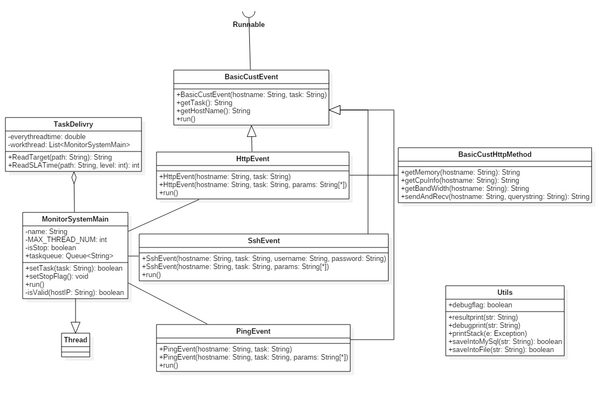
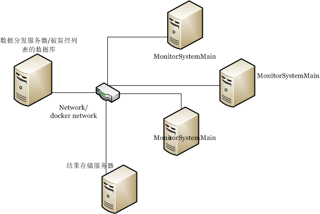

# Monitor System
---
### 总体描述
此系统能够监控**大量**的服务器（例如web server, workstation等等）。完成大量监测任务所耗的时间必须满足客户的需求（ **SLA** ）。因此在系统设计的时候，需考虑如何**最大**程度利用监测服务器的资源，并提供很好的扩展性，能够应对用户不断改变或者增长的监测需求（监测内容增加，监测数目增加等）。
  
本系统的基本特性在于并发和模块封装。

---
### 设计思路
首先给出一个设计类图：  

<small>Monitor System 类图</small>

TaskDelivery类是本程序的主要入口，AndroidSystemMain类完成各种监测任务。每种监测任务分别由对应的Event(HttpEvent、SshEvent、PingEvent)去完成。每个类都能很方便的单独运行，以适应服务器的不同部署。

<small>可扩展的架构</small>

为了适应被监测服务器的数量，可以像上图那样部署系统。增加一个数据分发服务器（存储被监测服务器的列表）和结果存储服务器（存储监测得到的结果）。有点类似于CDN（Content Delivery Network），通过某种规则（1. 监测服务器和被监测服务器的距离---**减少路由的时间**；2. 为被检测服务器的IP或者域名建立索引---**避免数据冲突，减少握手时间**；等方式）进行任务的分发。所有监测服务器的结果都传输给结果存储服务器。这种架构可以通过增加服务器（硬件）和docker（虚拟）都能很轻松实现。

**系统的输入：**    
1. 需要监控的target列表  
2. 承诺客户的SLA时间。

这两个输入，通过json格式的数据文件来实现：  
JSON(JavaScript Object Notation) 是一种轻量级的数据交换格式。易于人阅读和编写，同时也易于机器解析和生成。  	
1. monitortarget.json
  
	{  
    	"hostIP":"192.168.1.100",     # IP OR DOMAIN NAME. EG. WWW.BAIDU.COM  
    	"http": false,                # WHETHER MONITORING TARGETS VIA HTTP OR NOT 
									  # TRUE: DO ; FALSE: UNDO
    	"hostPort":"8010",            # HTTP PORT
		"httpmethod":[                # METHODS CAN BE CALLED VIA HTTP
         {"method":"getMemory"},      
         {"method":"getCpuInfo"},
         {"method":"getBandWidth"}
         ],
    	"ssh": true,                  # WHETHER MONITORING TARGETS VIA HTTP OR NOT 
									  # TRUE: DO ; FALSE: UNDO
    	"sshusername": "shkotori",    # USER NAME
    	"sshpasswd": "iloveyou52917", # PASSWORD
    	"sshmethod":[                 # COMMAND LINE CAN BE EXECUTED BY SSH
       	{"method":"cat /proc/meminfo"}, 
       	{"method":"shell getcpu.sh"},
    	],
    	"ping": false                # WHETHER MONITORING TARGETS VIA HTTP OR NOT          
									 # TRUE: DO ; FALSE: UNDO
  	}

为了适应SLA服务，根据具体情况，增加并发线程。

 **任务具体执行：**  

以Http方式为例，当HttpEvent接收到任务以后，根据任务（task)的具体类型，通过反射调用`BasicCustHttpMethod`的方法，由其执行具体的监测任务。如果需要在HTTP中添加新的监测函数，只需要在`BasicCustHttpMethod`中添加函数，并在配置文件中添加即可。

 **可以优化的点：**  

其实在`MonitorSystemMain`也可以采用这种方式（反射），增加新的监测方式也就更容易，只需要在对应的配置文件添加。

**目前的代码**(MonitorSystemMain根据task任务类型，构造相应的task runner):

	ExecutorService es = Executors.newFixedThreadPool(MAX_THREAD_NUM); 
	HttpEvent hpevent = new HttpEvent("http://"+hostIP+":"+hostPort, httpmethod.getJSONObject(j).getString("method"));  
    es.execute(hpevent);
	SshEvent sshevent = new SshEvent(hostIP, sshmethod.getJSONObject(j).getString("method"), username, passwd);  
	es.execute(sshevent);
	PingEvent pingevent = new PingEvent(hostIP,"");
    es.execute(pingevent);

**改进后的代码**：

- **数据以txt或sql的方式存储**  

		[way]:[method]:[param0 param1 ……]　　　 #way:监测方法  method:具体任务函数  param0和param1是函数参数
    	Http:getMemory:    
		Ssh:cat /proc/memory:username password
		Ping::	

- **统一构造函数**  

		public HttpEvent(String hostname, String task, String[] params) {
		super(hostname, task);		
		}
		public SshEvent(String hostname, String task, String[] params) {
			super(hostname, task);
 			user = params[0];
			passwd = params[1];	
		}
		public PingEvent(String hostname, String task, String[] params) {
			super(hostname, task);		
		}

- **根据输入反射调用相应Event（HttpEvent、SshEvent、PingEvent等）**
	`MonitorSystemMain.java`只需很少的改动

		// String way = "Http";
		// String method = "getMemory";
		// String params = new String{};
		ExecutorService es = Executors.newFixedThreadPool(MAX_THREAD_NUM);
		Class<?> clazz = Class.forName(this.getPackageName()+way+"Event"); 
		Constructor<?> constructors = clazz.getConstructor(String.class, String class, String[].class);	
		String[] params = new String[]{};
		BasicCustEvent event = (BasicCustEvent)constructors.newInstance(hostIP,method,params);
		es.execute(event);

 **TODO Lists：** 

- 用户输入的合法性检测  
任何的输入都是不可靠的，需要做验证。  
预留接口：`boolean isValid(String hostIP)   (MonitorSystemMain.java)`  

- http和ssh监测方法的格式化输出  
目前实现的MonitorSystem，仅将target返回的结果输出到console。**为了方便将结果插入数据库、或者传送给三方软件，因此在程序设计时最好将结果保存在方便格式化输出的数据结构中。**http和ssh可以获得的数据太多，不清楚用户感兴趣哪些，需要和用户沟通后设计，就像**`PingEvent`的`returnRes`**那样。

- ssh用户的密码加密  
目前配置文件中密码是明文，应该采用密文。

- exception的封装   
java的`checked exception`是在是太多了，利于调试，但也带来不少麻烦。`ClassNotFoundException`、`InstantiationException`、`SecurityException`、`IllegalAccessException`等可以将Exception归我自己的几类，便于处理。

		try {  
		} catch (SecurityException e) {
			throw new NetworkException(e);
		}

- 完善结果输出接口  
辅助方法都定义在类`Utils`中。为了让结果输出到不同的地方，例如console、文件、数据库和其他三方软件中，在Utils中定义了一系列接口（未实现）。

		public static boolean saveIntoMySql(String str) 
		public static boolean saveIntoFile(String str) 

---
### 测试说明
#### 测试HTTP方法  
1. 配置monitortarget.json,根据你感兴趣的东西，选择合适的“RPC”函数  

		"hostIP":"192.168.1.100"  
		"http": true
		"hostPort":"8010"  
		"httpmethod":[        
		{"method":"getMemory"},   
		{"method":"getCpuInfo"},  
		{"method":"getBandWidth"}  
		],   
2. 运行target（eg.web server)  
为了模拟target，提供了一个简单的程序，它能够监听网络接口，并能解析get method。根据get query string 返回一个固定的值。 源码在javaserver文件夹内  
Windows:　　
运行`javaserver.bat`     
Linux:　　  运行`javaserver.sh`

3. 运行MonitorSystem  
Windwons:　　 运行`MonitorSystem.bat`  
Linux:   　　  运行`MonitorSystem.sh`

#### 测试SSH方法
1. 配置monitortarget.json，根据你感兴趣的东西，添加合适的执行命令  

		"ssh": true,          
		"sshusername": "xxx",  
		"sshpasswd": "***", 
		"sshmethod":[                
		{"method":"cat /proc/meminfo"},   
		{"method":"shell getcpu.sh"},  
		],  
   
2. 准备好需要监控的Linux主机，运行MonitorSystem
这里采用Linux主机，需要开启ssh服务  
		
		sudo apt-get install openssh-client
		sudo apt-get install openssl-server  
		sudo /etc/init.d/ssh start
如果采用docker的话，就可以写成如下Dockerfile，制作自己的镜像: 

    	# Version 0.0.1  
  		FROM ubuntu:14.04     
  		MAINTAINER sofat "sofat1989@126.com"     
  		RUN apt-get install openssh-client && apt-get install  openssh-server
		RUN /etc/init.d/ssh start  
		EXPOSE 22  
3. 运行MonitorSystem

#### 测试PING方法
1. 配置monitortarget.json，运行MonitorSystem

		"ping": true

---
### 系统维护
类`Utils`中定义了`debugprint`和`printStack`函数。其输出由`debugflag`控制。当`debugflag`设置为true，就会在控制台输出调试信息。如果系统出现了异常，可以打开这个开关，进行定位。
#### 代码修改
如果想要对代码修改，该工程能够直接在eclipse中导入，修改并编译
也可以直接修改文件，利用gradle进行构建。  

    cd ebay
	gradle build
	cd javaserver
	gradle build
构建完成以后，执行新的程序，可使用脚本：  

    MonitorSystem_gradle.bat     windows
	MonitorSystem_gradle.sh      linux
	javaserver_gradle.bat        windows
	javaserver_gradle.sh 		 linux

#### 可调整的参数

`TaskDelivery`中的`everythreadtime`：预估一个`MonitorSystemMain`处理一个target需要的时间   
`MonitorSystemMain`中`MAX_THREAD_NUM`：一个`MonitorSystemMain`能容纳的最大线程数（主要因素还是内存）  
这两个参数需要根据服务器硬件资源等做一点调整。

